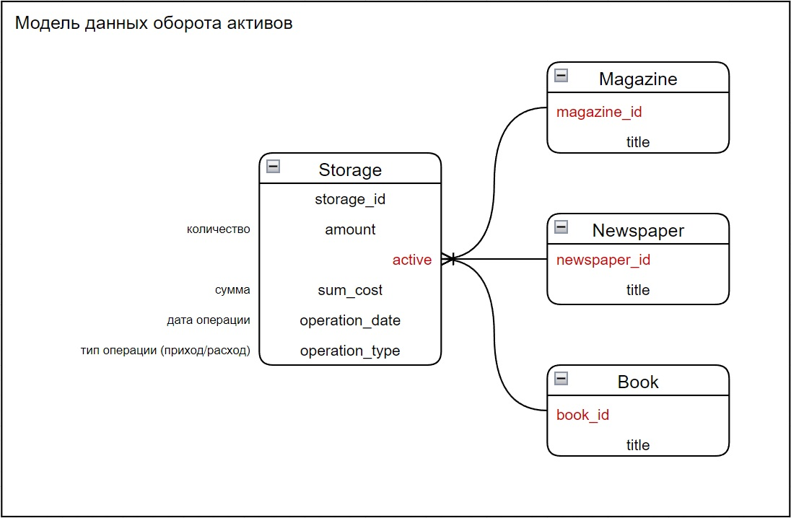

# test_solutions

## Задание 1

```sql
Вы получили в распоряжение SQL-запрос, который был кем-то извлечён путём команды
print(some_queryset.query).
В грубом приближении запрос выглядит так:

SELECT *
FROM school_library_bооk
WHERE authоr_id IN (2, 3, 5) OR authоr_id = is_active
UNION
SELECT * FROM school_library_bооk
WHERE authоr_id IN (7, 8, 9) OR is_active
```

__Задание__: Дайте своё предположение о том, какое используется Django-приложение, какая
задействована модель и как выглядел синтаксис этого some_queryset.

### Ответ

Ориентируясь на название таблицы ```school_library_bооk```, здесь использую приложение с названием ```school_library```, в которой создаю модель ```Book``` и ```Author```.

Модель данных:
```python
class Author(models.Model):
    author_id = models.AutoField(primary_key=True)
    name = models.CharField(max_length=255)


class Book(models.Model):
    book_id = models.AutoField(primary_key=True)
    title = models.CharField(max_length=255)
    is_active = models.BooleanField()
    author = models.ForeignKey(
        Author,
        on_delete=models.CASCADE,
        related_name='books'
    )
```

Получение some_queryset:
```python
def some_queryset(request):
    queryset1 = Book.objects.filter(
        models.Q(author_id__in=(2, 3, 5)) | models.Q(is_active=True)
    )
    queryset2 = Book.objects.filter(
        models.Q(author_id__in=(7, 8, 9)) | models.Q(is_active=True)
    )
    union_queryset = queryset1.union(queryset2) 

    return HttpResponse(union_queryset)
```

Синтаксис some_queryset:
```sql
SELECT
    "school_library_book"."book_id" AS "col1",
    "school_library_book"."title" AS "col2",
    "school_library_book"."is_active" AS "col3",
    "school_library_book"."author_id" AS "col4"
FROM "school_library_book"
WHERE (
    "school_library_book"."author_id" IN (2, 3, 5) OR "school_library_book"."is_active"
)
UNION
SELECT
    "school_library_book"."book_id" AS "col1",
    "school_library_book"."title" AS "col2",
    "school_library_book"."is_active" AS "col3",
    "school_library_book"."author_id" AS "col4"
FROM "school_library_book"
WHERE (
    "school_library_book"."author_id" IN (7, 8, 9) OR "school_library_book"."is_active"
)
```

Проверить работу можно запустив проект - ```python manange.py runserver```. Результат будет доступен по адресу ```http://localhost:8000/some_queryset/```

## Задание 2

```sql
Представьте себя на месте разработчика бэкенда для Youtube. Технический директор
обратился к Вам с требованием ускорить процедуру очистки истории просмотров у
пользователей. Текущая реализация собирает всю накопленную историю
просмотренных видео и выполняет команду delete(). Пользователи, которые
посмотрели более 10000 видео, вынуждены ждать очистки около 10 секунд.
```

__Задание__: Какое решение Вы предложили техническому директору, благодаря которому,
история просмотра очищается за микросекунды. 

### Ответ

Я бы предложил добавить Celery к проекту, чтобы удаление происходило в фоне, тем самым не заставляя ждать пользователя завершения этой задачи, но перейдём к заданию 3. :)

## Задание 3

```sql
ChatGPT дал обширный перечень возможностей для решения второго вопроса. Вы
пошли с этим перечнем к техническому директору. Вам сообщили, что использовать
дополнительное программное обеспечение, усложнять избыточным кэшированием
систему никто не будет.
```

__Задание__: Требуется более простое решение.

### Ответ

Так как нужно более простое решение, чем сторонние инструменты, то я бы в таком случае заменил стандартный delete() на его асинхронный аналог, adelete(). Который явно работает быстрее.

Для примера можно использовать приложение созданное приложение ```youtube_records```.
С помощью команды  ```python manage.py addrecords amount```, добавляются простые тестовые записи в БД (вместо ```amount``` указать нужное кол-во записей к добавлению).

Далее запустить проект - ```python manange.py runserver```.

Удаление всех созданных ранее записей находится по адресу ```http://localhost:8000/delete_records/``` (на экране будет отображено время, затраченное на удаление всех записей).

## Задание 4

```sql
Спроектируйте Модель таблицу прихода и расхода активов, состоящую из следующих
полей: актив, дата операции, количество, сумма. Однако, в поле актив должны попадать
объекты из разных моделей, например, активом может быть Книга, Журнал, Газета.
Предположим, что архитектуры моделей ещё нет и Вы проектируете своё решение с
нуля.
```

### Ответ

Все модели и их связи реализованы в приложении ```income_models```, и зарегистрированы в админ-панели Django. Админ панель доступна по адресу ```http://localhost:8000/```, логин и пароль для входа при локальном запуске ```admin / admin``` сответственно.


